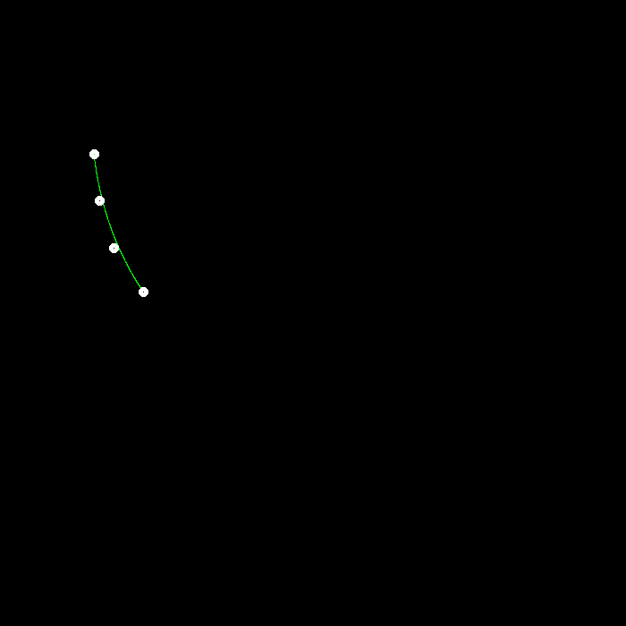
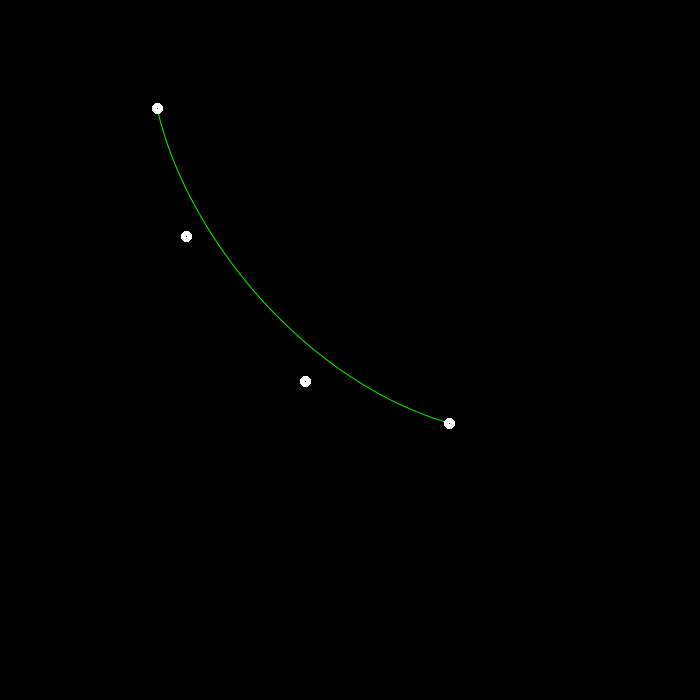

# GAMES101 Assignment 4 — Bézier Curve

## Overview

This project implements a Bézier curve renderer using the **de Casteljau recursive algorithm**.

Implemented features include:

- Recursive Bézier curve evaluation
- Interactive control point input
- Bézier curve rendering
- Anti-aliasing (**Bonus**)

---

## Recursive Bézier Algorithm

Implemented inside `recursive_bezier()`.

The algorithm recursively interpolates between neighbouring control points until only one point remains.

This final point lies on the Bézier curve.

---

## Bézier Curve Rendering

Implemented inside `bezier()`.

The program iterates through `t = 0 → 1` with small increments and evaluates Bézier curve positions using the recursive algorithm.

The resulting Bézier curve is rendered in **green**.

---

## Anti-aliasing Bonus

Implemented anti-aliasing to smooth Bézier curve edges.

Instead of coloring only a single pixel, neighbouring pixels are also colored based on their distance to the curve.

Pixels closer to the curve receive higher intensity values, producing smoother visual results and reducing jagged edges.

---

## Rendering Results

### Basic Bézier Curve



### Anti-aliased Bézier Curve



---

## Technologies

- C++
- OpenCV
- Recursive Algorithms

---

## How to Run

Build the project:

```bash
cmake --build .
```

Run:

```bash
.\Debug\BezierCurve.exe
```

Instructions:

1. Click four control points with the mouse.
2. The Bézier curve will be generated automatically.
3. The rendered image will be saved as `my_bezier_curve.png`.

---

## File Structure

```text
Assignment4/
│
├── main.cpp
├── CMakeLists.txt
├── README.md
│
├── images/
│   ├── bezier_basic.png
│   └── bezier_antialiasing.png
```

---

## Author

Developed as part of the GAMES101 Computer Graphics coursework.
