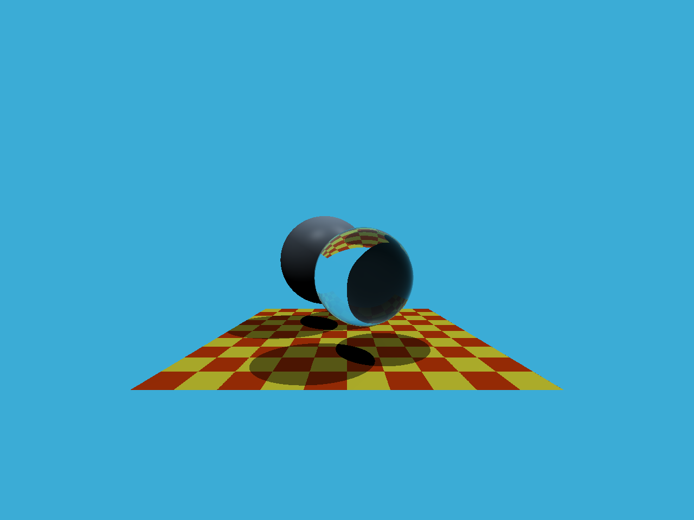

# GAMES101 Assignment 5 — Ray Tracing

## Overview

This project implements a basic ray tracing renderer.

Implemented features include:

- Primary ray generation
- Ray-triangle intersection
- Möller-Trumbore intersection algorithm
- Phong shading
- Shadow rendering

The renderer generates rays from the camera through each pixel and computes intersections with scene geometry to produce the final rendered image.

---

## Ray Generation

Implemented inside:

```cpp
Renderer::Render()
```

For each pixel, a primary ray is generated from the camera origin toward the image plane.

The ray direction is computed using:

- Field of view (FOV)
- Aspect ratio
- Screen-space coordinate mapping

The generated direction vector is normalized before ray casting.

---

## Ray-Triangle Intersection

Implemented inside:

```cpp
rayTriangleIntersect()
```

The project uses the **Möller-Trumbore algorithm** to determine whether a ray intersects a triangle.

The algorithm computes:

- Triangle edges
- Cross products
- Determinants
- Barycentric coordinates

If the intersection point lies inside the triangle and in front of the camera, the function returns `true`.

---

## Phong Shading

The renderer computes lighting using the Phong illumination model.

The final color includes:

- Ambient lighting
- Diffuse reflection
- Specular highlights

Surface normals are used to calculate realistic lighting responses.

---

## Shadow Rendering

Shadow rays are cast toward light sources to determine visibility.

If another object blocks the light path, the point is considered in shadow.

This produces realistic dark shadow regions on the ground plane.

---

## Rendering Result



---

## Technologies

- C++
- Ray Tracing
- Möller-Trumbore Intersection
- Phong Lighting

---

## How to Run

Build the project:

```bash
cmake --build .
```

Run:

```bash
.\Debug\RayTracing1.exe
```

The rendered image will be saved as:

```text
binary.ppm
```

---

## File Structure

```text
Assignment5/
│
├── Renderer.cpp
├── Triangle.hpp
├── README.md
│
├── images/
│   └── render_result.png
```
