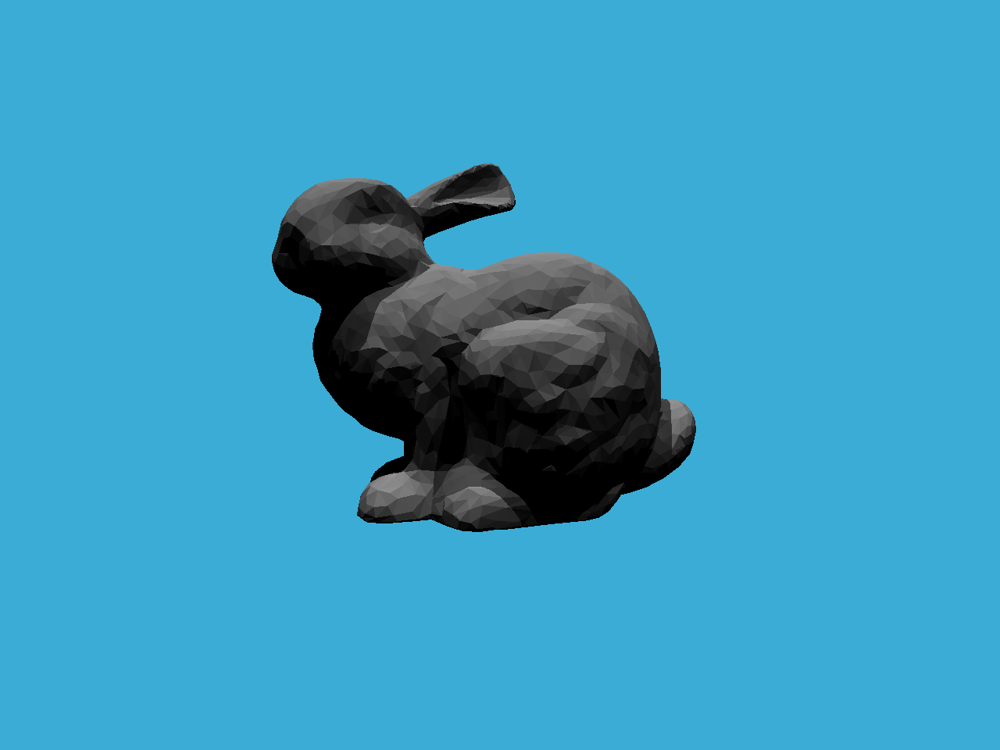
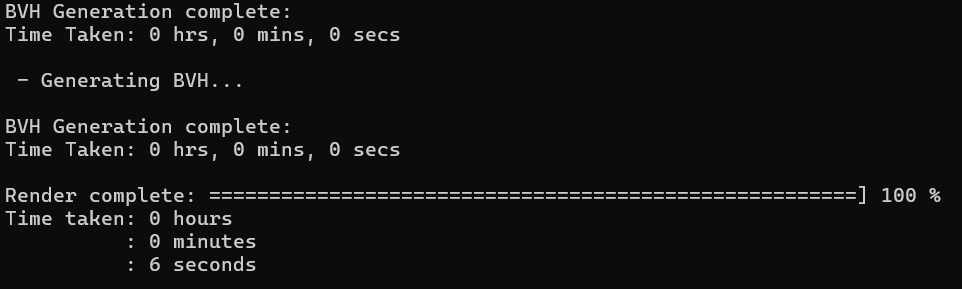
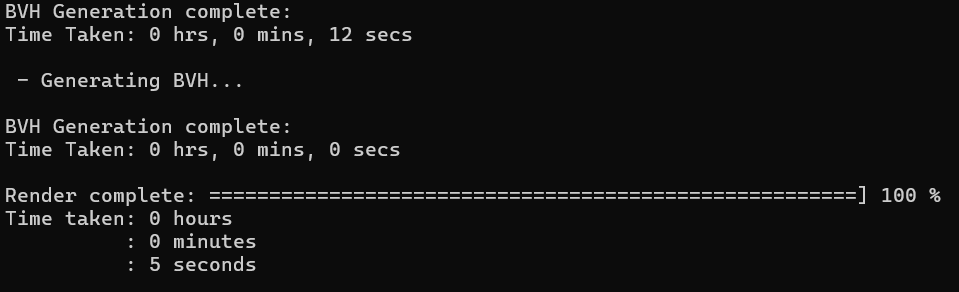

# GAMES101 Assignment 6 — BVH Acceleration & SAH Bonus

## Overview

This project implements BVH (Bounding Volume Hierarchy) acceleration for ray tracing.

Implemented features include:

- Primary ray generation
- Ray-triangle intersection
- Bounding box intersection
- BVH recursive construction
- BVH traversal
- SAH (Surface Area Heuristic) bonus acceleration

The purpose of BVH is to reduce the number of ray-object intersection tests and improve rendering performance.

---

# Primary Ray Generation

Implemented inside:

```cpp
Renderer::Render()
```

For each pixel, a primary ray is generated from the camera position toward the image plane.

The ray direction is computed using:

- Field of view (FOV)
- Aspect ratio
- Screen-space coordinate mapping

The generated direction vector is normalized before ray casting.

---

# Ray-Triangle Intersection

Implemented using the Möller-Trumbore intersection algorithm.

The algorithm computes:

- Triangle edges
- Cross products
- Determinants
- Barycentric coordinates

If the intersection point lies inside the triangle and in front of the camera, the intersection is considered valid.

---

# Bounding Box Intersection

Implemented inside:

```cpp
Bounds3::IntersectP()
```

Ray-box intersection is performed using the slab method.

The algorithm computes entering and exiting distances for:

- X axis
- Y axis
- Z axis

If the valid intervals overlap, the ray intersects the bounding box.

This greatly reduces unnecessary ray-triangle intersection tests.

---

# BVH Construction

Implemented inside:

```cpp
BVHAccel::recursiveBuild()
```

The BVH recursively splits objects into left and right child nodes.

The splitting process:

1. Compute centroid bounds
2. Find the longest axis
3. Sort objects along the axis
4. Split objects into two groups
5. Recursively build child nodes

Leaf nodes contain the actual scene geometry.

---

# BVH Traversal

Implemented inside:

```cpp
BVHAccel::getIntersection()
```

The renderer traverses the BVH recursively.

Traversal steps:

1. Test ray against node bounding box
2. If no intersection, skip the node
3. If leaf node, test geometry intersection
4. Otherwise recursively test child nodes
5. Return the closest valid intersection

This significantly improves ray tracing efficiency.

---

# SAH Bonus

Implemented Surface Area Heuristic (SAH) splitting for BVH construction.

Instead of splitting objects directly at the midpoint, the SAH method evaluates multiple split positions and estimates traversal cost using bounding box surface areas.

The split with the minimum estimated cost is selected.

The SAH cost function is:

```text
Cost = Ct + (SA(L) / SA(P)) * NL + (SA(R) / SA(P)) * NR
```

Where:

- SA(L) = surface area of left child
- SA(R) = surface area of right child
- SA(P) = surface area of parent node
- NL / NR = number of primitives in left/right child

The SAH implementation reduces traversal cost and improves rendering performance compared to naive median splitting.

---

# BVH vs SAH Performance

| Method | Render Time |
|---|---|
| NAIVE BVH | 6 seconds |
| SAH BVH | 5 seconds |

The SAH implementation achieved faster rendering performance compared to the naive BVH split method.

---

# Rendering Results

## NAIVE BVH



---

## SAH BVH



---

# Technologies

- C++
- Ray Tracing
- BVH Acceleration
- SAH Optimization

---

# How to Run

Build the project:

```bash
cmake --build .
```

Run:

```bash
.\Debug\RayTracing.exe
```

The rendered image will be saved as:

```text
binary.ppm
```

---

# File Structure

```text
Assignment6/
│
├── Renderer.cpp
├── BVH.cpp
├── Bounds3.hpp
├── Triangle.hpp
├── Scene.cpp
├── README.md
│
├── images/
│   ├── NAIVE_BVH.png
│   ├── SAH.png
│   ├── binary.png
│   └── SAH_BVH.png
```
