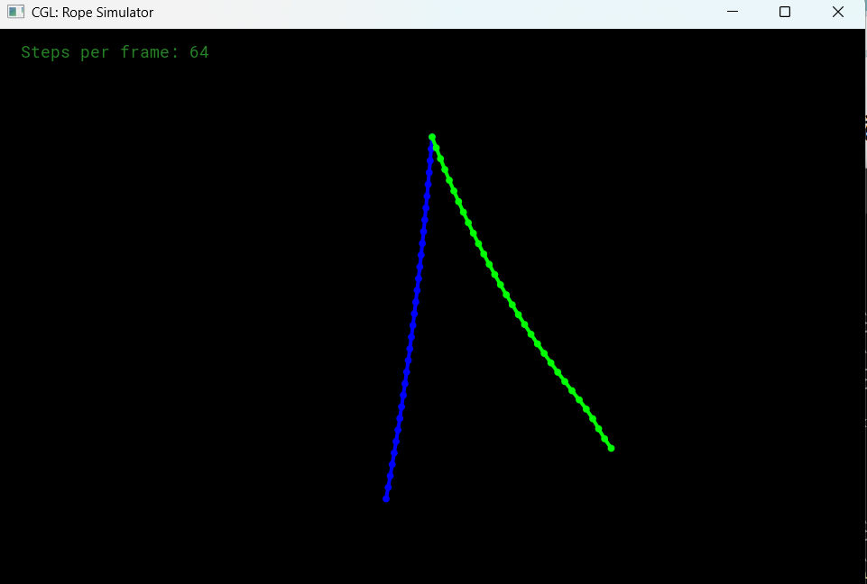
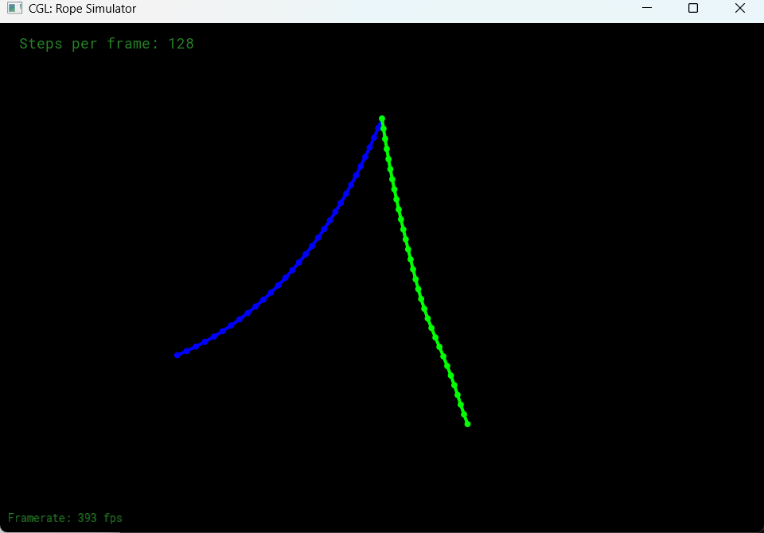

# GAMES101 Assignment 8 — Rope Simulation

## Overview

This project implements a mass-spring rope simulation system using:

- Semi-implicit Euler Integration
- Explicit Verlet Integration
- Hooke’s Law
- Gravity
- Global Damping
- Pinned Constraints

The rope is represented as a series of masses connected by springs.

---

# Rope Construction

Implemented inside:

```cpp
Rope::Rope(...)
```

The rope is created by:

1. Generating evenly spaced mass nodes between the start and end points
2. Connecting adjacent masses with springs
3. Pinning selected nodes

Each mass stores:

- Position
- Velocity
- Force
- Mass
- Pinned state

Each spring stores:

- Two connected masses
- Spring constant
- Rest length

---

# Hooke's Law

Spring forces are computed using Hooke’s Law:

```text
F = k(x - L)
```

Where:

- `k` = spring stiffness
- `x` = current spring length
- `L` = rest length

The spring force pulls stretched springs back toward their rest length and pushes compressed springs apart.

---

# Semi-implicit Euler Integration

Implemented inside:

```cpp
Rope::simulateEuler()
```

Simulation steps:

1. Compute spring forces
2. Add gravity force
3. Compute acceleration
4. Update velocity
5. Update position
6. Apply damping

Update equations:

```text
a = F / m
v = v + a * dt
p = p + v * dt
```

The Euler method is simple and efficient but can become unstable with large time steps.

---

# Verlet Integration

Implemented inside:

```cpp
Rope::simulateVerlet()
```

The Verlet method updates positions directly using previous positions instead of explicit velocities.

Update equation:

```text
new_position =
current_position +
(current_position - last_position) +
acceleration * dt²
```

Advantages of Verlet integration:

- More stable
- Better for constraints
- Commonly used in cloth and rope simulation

---

# Damping

Global damping was added to reduce oscillation and stabilize the rope.

Euler damping:

```cpp
velocity *= 0.99
```

Verlet damping:

```cpp
(1 - damping_factor)
```

This prevents the rope from oscillating forever.

---

# Pinned Nodes

Pinned nodes remain fixed in space and act as rope anchors.

Example:

```cpp
{0}
```

Pins the first mass node of the rope.

---

# Simulation Configuration

| Setting | Value |
|---|---|
| Rope Nodes | 32 |
| Steps Per Frame | 64 / 128 |
| Integration Methods | Euler & Verlet |
| Gravity | Enabled |
| Damping | Enabled |

---

# Simulation Results

## Rope Simulation

Blue Rope = Euler Integration  
Green Rope = Verlet Integration



---

## Higher Steps Per Frame

Increasing `steps_per_frame` improves simulation stability and smoothness.



---

# Key Observations

- Euler integration is simpler but less stable
- Verlet integration produces smoother rope motion
- Increasing simulation steps improves stability
- Damping reduces excessive oscillation

---

# Technologies

- C++
- OpenGL
- Mass-Spring Systems
- Semi-implicit Euler Integration
- Verlet Integration
- Physics Simulation

---

# How to Run

Build:

```bash
cmake --build .
```

Run:

```bash
.\Debug\ropesim.exe
```

Adjust simulation quality:

```bash
.\Debug\ropesim.exe -s 128
```

---

# File Structure

```text
Assignment8/
│
├── rope.cpp
├── rope.h
├── spring.h
├── mass.h
├── application.cpp
├── README.md
│
├── images/
│   ├── rope_simulation.png
│   └── steps_per_frame.png
```

---
